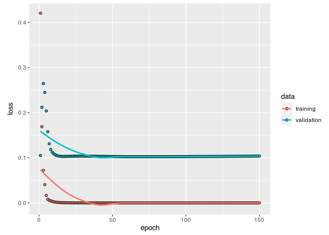

Model
================

## Quarto

Quarto enables you to weave together content and executable code into a
finished document. To learn more about Quarto see <https://quarto.org>.

## Reading the data in

We use the R packages tensorflow and readxl

``` r
library(tensorflow)
library(tm)
```

    Loading required package: NLP

``` r
library(data.table)
library(stringr)
library(NLP)
library(AUC)
```

    AUC 0.3.2

    Type AUCNews() to see the change log and ?AUC to get an overview.

``` r
keywords <- readLines("../data-raw/keywords.txt")

data_yes <- fread("../data-raw/elegible.csv") 
data_no  <- fread("../data-raw/inelegible.csv") 

data_all <- rbind(data_yes, data_no, fill = TRUE)
n <- nrow(data_all)
```

## Identifying key concepts

``` r
# Generating abstract clean
data_all[, abstract := Abstract]
data_all[, abstract := tolower(abstract)]

extract_ngrams <- function(dat, name. = "ngrams") {
  
  ngrams_1 <- str_split(tolower(dat), "\\s+|\\n")

  ngrams_2 <- lapply(ngrams_1, ngrams, n = 2) |>
    lapply(\(d) sapply(d, paste, collapse = " ", simplify = FALSE)) |>
    lapply(\(d) unique(unlist(d)))
  
  ngrams_4 <- lapply(ngrams_1, ngrams, n = 4) |>
    lapply(\(d) sapply(d, paste, collapse = " ", simplify = FALSE)) |>
    lapply(\(d) unique(unlist(d)))
  
  ngrams_3 <- lapply(ngrams_1, ngrams, n = 3) |>
    lapply(\(d) sapply(d, paste, collapse = " ", simplify = FALSE))  |>
    lapply(\(d) unique(unlist(d)))
  
  assign(x = paste0(name., "_1"), value = ngrams_1, envir = .GlobalEnv)
  assign(x = paste0(name., "_2"), value = ngrams_2, envir = .GlobalEnv)
  assign(x = paste0(name., "_3"), value = ngrams_3, envir = .GlobalEnv)
  assign(x = paste0(name., "_4"), value = ngrams_4, envir = .GlobalEnv)
  
}

extract_ngrams(data_all$Abstract)

# Ranking the ngrams_3 and ngrams_4
ngrams_top_2 <- table(unlist(ngrams_2, recursive = TRUE)) |> as.data.table()
setorder(ngrams_top_2, -N)

# Removing those with stopwords
stopw <- paste0("^(", paste(tm::stopwords(), collapse = "|"), "|\\s)+$")
ngrams_top_2[grepl(stopw, V1) == FALSE]
```

                             V1   N
        1:          copyright © 132
        2:          of covid-19  81
        3:         the covid-19  73
        4:            number of  58
        5:           this study  55
       ---                         
    34912:              zero in   1
    34913: zhang, dhanalakshmi,   1
    34914:         zhang, elahe   1
    34915:              zn, cd,   1
    34916:           zone, such   1

``` r
ngrams_top_3 <- table(unlist(ngrams_3, recursive = TRUE)) |> as.data.table()
setorder(ngrams_top_3, -N)

ngrams_top_4 <- table(unlist(ngrams_4, recursive = TRUE)) |> as.data.table()
setorder(ngrams_top_4, -N)

# For each, we will keep the ngrams with at least 5 cases
ngrams_top_2 <- ngrams_top_2[1:200]
ngrams_top_3 <- ngrams_top_3[1:200][N >= 5]
ngrams_top_4 <- ngrams_top_4[1:100][N >= 5]

# Keyterms
keyterms <- c(ngrams_top_2$V1, ngrams_top_3$V1, ngrams_top_4$V1, keywords)
k <- length(keyterms)
```

# Generating the data matrix

``` r
build_mat <- function(ng1, ng2, ng3, ng4, keyterms.) {
  
  n. <- length(ng1)
  k. <- length(keyterms.)
  
  data_mat <- matrix(
    0L,
    nrow = n., ncol = k., 
    dimnames = list(1:n., keyterms.)
    )
  
  # One term
  idx_1 <- Map(\(a,b) {
    a <- intersect(a, keyterms.)
    cbind(rep(b, length(a)), a)
    }, a = ng1, b = 1:n.) |>
    do.call(what = rbind)
  
  data_mat[idx_1] <- 1L
  
  # Two terms
  idx_1 <- Map(\(a,b) {
    a <- intersect(a, keyterms.)
    cbind(rep(b, length(a)), a)
    }, a = ng2, b = 1:n.) |>
    do.call(what = rbind)
  
  data_mat[idx_1] <- 1L
  
  # Three terms
  idx_1 <- Map(\(a,b) {
    a <- intersect(a, keyterms.)
    cbind(rep(b, length(a)), a)
    }, a = ng3, b = 1:n.) |>
    do.call(what = rbind)
  
  data_mat[idx_1] <- 1L
  
  # Four terms
  idx_1 <- Map(\(a,b) {
    a <- intersect(a, keyterms.)
    cbind(rep(b, length(a)), a)
    }, a = ng4, b = 1:n.) |>
    do.call(what = rbind)
  
  data_mat[idx_1] <- 1L
  
  data_mat
  
}
data_mat <- build_mat(ngrams_1, ngrams_2, ngrams_3, ngrams_4, keyterms. = keyterms)
```

``` r
library(Matrix)
as(data_mat, "dgCMatrix") |> image(main = "Model matrix\n(top keywords, 2-grams, 3-grams, and 4-grams)")
```


# Building the convolutional neural network (data)

``` r
set.seed(1231)
n_yes <- nrow(data_yes)
n_no  <- nrow(data_no)

prop_train <- .7

train_yes_id <- sample.int(n_yes, n_yes * prop_train) |> sort()
train_no_id  <- sample.int(n_no, n_no * prop_train) |> sort()

n_train <- length(train_yes_id) + length(train_no_id)

# Features
x_train <- data_mat[c(train_yes_id, n_yes + train_no_id),] |>
  as.vector() |>
  array_reshape(c(n_train, k), order = "F")

x_test <- data_mat[c(-train_yes_id, -(n_yes + train_no_id)),] |>
  as.vector() |>
  array_reshape(c(n - n_train, k), order = "F")

# Labels
y_train <- c(rep(1, length(train_yes_id)), rep(0, length(train_no_id))) |>
  array_reshape(c(n_train, 1), order = "F")

y_test <- c(rep(1, n_yes - length(train_yes_id)), rep(0, n_no - length(train_no_id))) |>
  array_reshape(c(n - n_train, 1), order = "F")
```

# Building the model

``` r
# Setting the seed
library(keras)
tensorflow::set_random_seed(5554)
```

    Loaded Tensorflow version 2.9.1

``` r
# Building the model
model <- keras_model_sequential(
  name = "LitRev"
) |>
  # Entry layer
  layer_dense(
    units = (k), input_shape = k
    ) |>
  layer_activation_relu() |>
  layer_dropout(rate = .2) |>
  layer_activation_relu() |>
  layer_dense(units = 1, activation = "sigmoid")
  

model |> compile(
  loss = loss_mean_absolute_error,
  keras::optimizer_adam(learning_rate = .01),
  metrics = list(NULL), weighted_metrics = list(NULL), 
)

# Fitting the model
history <- model |>
  fit(
    x_train, y_train,
    epochs = 150,
    batch_size = 16 * 4, 
    verbose = 2,
    validation_split = .2 #, sample_weight = w
    )

plot(history)
```



``` r
# 
# Saving the model -------------------------------------------------------------
if (!dir.exists("modelo-00-keras")) {
  dir.create("modelo-00-keras")
} else {
  file.remove(list.files("modelo-00-keras", all.files = TRUE, full.names = TRUE))
}
```

    Warning in file.remove(list.files("modelo-00-keras", all.files = TRUE,
    full.names = TRUE)): cannot remove file 'modelo-00-keras/.', reason 'Invalid
    argument'

    Warning in file.remove(list.files("modelo-00-keras", all.files = TRUE,
    full.names = TRUE)): cannot remove file 'modelo-00-keras/..', reason 'Directory
    not empty'

    Warning in file.remove(list.files("modelo-00-keras", all.files = TRUE,
    full.names = TRUE)): cannot remove file 'modelo-00-keras/variables', reason
    'Directory not empty'

    [1] FALSE FALSE  TRUE  TRUE  TRUE FALSE

``` r
model$save("modelo-00-keras")
```

``` r
evaluate(model, x_test, y_test)
```

         loss 
    0.1863797 

``` r
p <- predict(model, x = x_test)

aucs <- AUC::roc(
  p, labels = as.factor(y_test)
) 
plot(aucs, main = sprintf("AUC-ROC %.2f", auc(aucs)))
```


# Predicting for the larger dataset

``` r
dat_to_score <- fread("../data-raw/not-screened.csv")
extract_ngrams(dat_to_score$Abstract, name. = "ngrams_2")
data_mat <- build_mat(ngrams_2_1, ngrams_2_2, ngrams_2_3, ngrams_2_4, keyterms. = keyterms)

x_new <- data_mat |>
  as.vector() |>
  array_reshape(c(nrow(data_mat), k), order = "F")

p2 <- predict(model, x = x_new)

res <- data.table(
  score_txt = fifelse(p2 > .90, "Yes", fifelse(p2 < .10, "No", "Not sure")),
  score = as.vector(p2),
  dat_to_score[, .(Title, Authors, `Accession Number`, `Published Year`, Journal)]
  )
res <- res[order(-abs(fifelse(score > .5, score, 1-score))),]

fwrite(res, "model0-predictions.csv")
```
